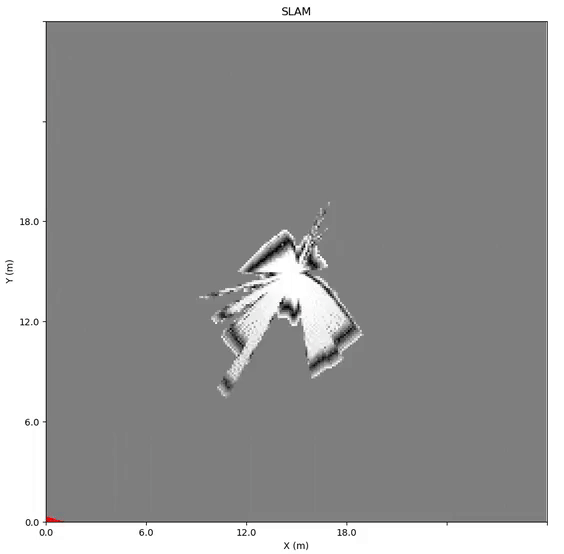
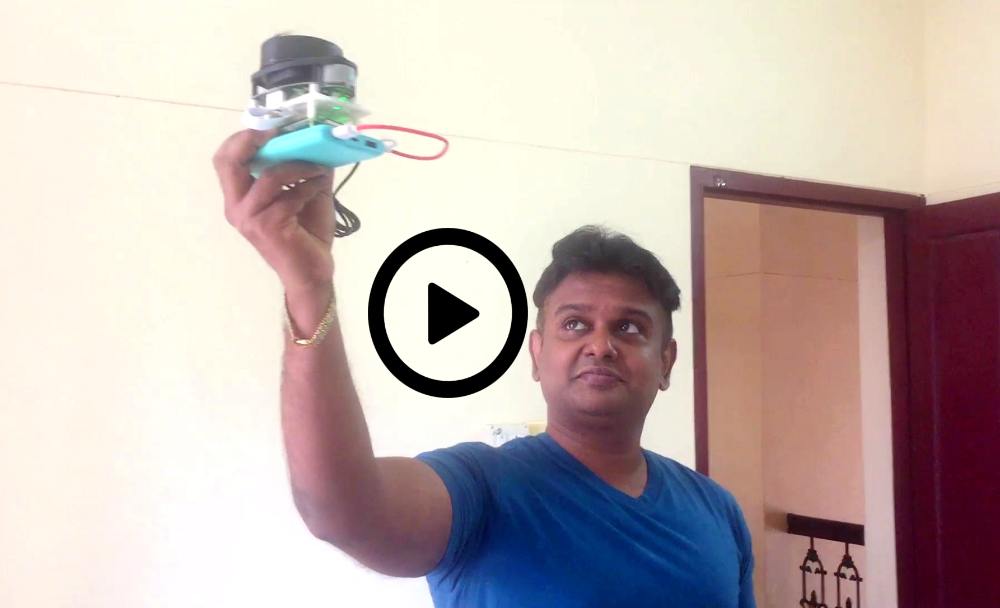
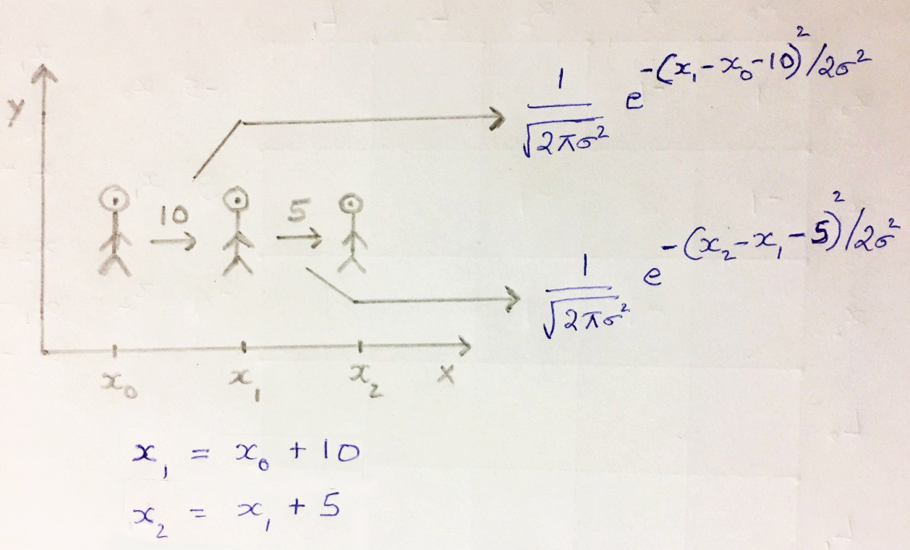
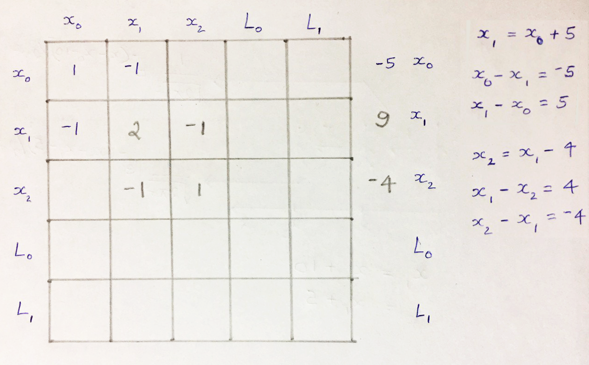
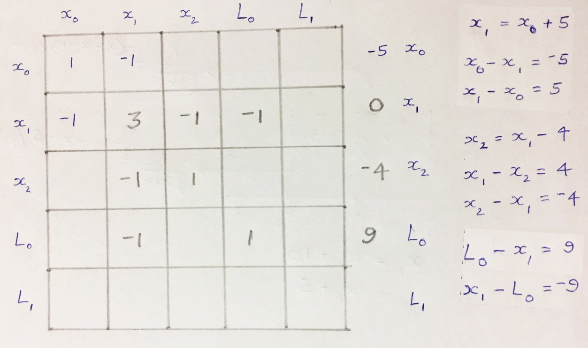

# SLAM on Raspberry Pi

_Simultaneous Localization and Mapping (SLAM) Navigation using RP LIDAR A1 on RPi with MQTT remote point cloud visualization_

<< blog link>>

SLAM (Simultaneous Localization And Mapping) algorithms use **LiDAR and IMU data to simultaneously locate the robot in real-time and generate a coherent map of surrounding landmarks such as buildings, trees, rocks, and other world features, at the same time.**

Though a classic chicken and egg problem, it has been approximately solved using methods like **Particle Filter, Extended Kalman Filter (EKF), Covariance intersection, and GraphSLAM**. SLAM enables accurate mapping where GPS localization is unavailable, such as indoor spaces.

Reasonably so, **SLAM is the core algorithm being used in robot navigation, autonomous cars, robotic mapping, virtual reality, augmented reality, etc. If we can do robot localization on RPi then it is easy to make a moving car or walking robot that can ply indoors autonomously.**

You can see the **visualization of the LIDAR point cloud map and estimated robot trajectory below.** The robot is going across different rooms on the floor, as you can see in the project demo video below.

<p align="center">
  
</p>

First, lets see SLAM in action and then the theory behind. SLAM is deployed on a RaspberryPi with RPLidar A1 M8, running on a 5V 3A battery. As you can see in the video, **the robot (portable unit) is taken across various rooms of my house and a real-time trajectory is transmitted to the MQTT server and also stored on the SD card of RPi.**
  
## Watch Project Demo

[](https://youtu.be/HrBcQpvx8gg)


## How to use this repo?

```
git clone https://github.com/simondlevy/BreezySLAM.git
cd to BreezySLAM/examples
sudo python3 setup.py install
```

```
git clone https://github.com/simondlevy/PyRoboViz.git
change to PyRoboViz base directory
sudo python3 setup.py install
```

To execute SLAM on Raspberry Pi,
```
python3 rpslam-thread.py
```

The map will be visualized in RPi itself. To enable visualization in a remote system, you can execute the MQTT version,
```
python3 rpslam-mqtt.py
```

**Note:** To enable persistence of the visualization map, please replace the **__init__.py** file in roboviz directory with the one in this repo and execute PyRoboViz setup script again from the PyRoboViz base directory, using the command below.

```
sudo python3 setup.py install
```

Before execution, create a directory named 'gif' inside the base directory of slam script to let the map images saved. These images are saved in time sequence so that a gif animation can be easily created.

_If the MQTT visualization is slow, then the bytearray transfer might be the bottleneck. You can either connect the RPi to router using a LAN cable (to improve the speed) or reduce the dimensions of the map to reduce the size of the bytearray. Instead you can reduce the MQTT publish frequency as well._


## Custom Graph SLAM Implementation

Let's discuss the theory behind GraphSLAM and see a custom implementation. Then we will attempt to integrate RPi with RPLidar A1 M8, running on a battery, and **do SLAM along with visualization of the LIDAR point cloud map to assist navigation or even to generate a floor map. Finally, the LIDAR point cloud map is visualized on a remote machine using MQTT. **

See the SLAM gadget below: **RaspberryPi integrated with RPLidar A1 M8, running on a 5V 3A battery.**

<p align="center">
  
</p>


### Graph SLAM Algorithm
- **Assume a robot in the 2D world**, tries to move 10 units to the right from x to x'. Due to motion uncertainty, x' = x + 10 may not hold, but **it will be a Gaussian centered around x + 10.** The Gaussian should peak when x' approaches x + 10



- Robot movement from x0 to x1 to x2 is **characterized by 2 Gaussian functions.** If x1 is away from x0 by 10 units, **the Kalman Filter models the uncertainty using the Gaussian with (x1 – x0 – 10).** Hence, there is still a probability associated with locations < 10 and > 10.
- There is another similar Gaussian at x2 with a higher spread. **The total probability of the entire route is the product of the two Gaussians.** We can drop the constants, as we just need to maximize the likelihood of the position x1, given x0. Thus **the product of Gaussian becomes the sum of exponent terms, i.e. the constraint has only x's and sigma.**
- **Graph SLAM models the constraints as System of Linear Equations (SLEs), with a Ω matrix containing the coefficients of the variables and a ξ vector that contains the limiting value of the constraints.** Every time an observation is made between 2 poses, a 'local addition' is done on the 4 matrix elements (as the product of gaussian becomes the sum of exponents).

Let's say, the robot moves from x0 to x1 to x2 which are 5 and -4 units apart.



The coefficient of x's and RHS values are added to corresponding cells. Consider the landmark L0 is at a distance of 9 units from x1.



You need to **update the values in the 2D Ω matrix and ξ vector, to account for motion and measurement constraints in the x and y directions.** You can find the full source code of custom Graph SLAM implementation 

Interestingly, we have re-routed the real-time visualization to a remote machine using MQTT. The robot position, angle, and map can be encoded as a byte array that is decoded by the MQTT client.

Note that, the high-dense linear point cloud in the LIDAR maps represents stable obstacles like walls. Hence, we can **use algorithms like Hough Transform to find the best fit line on these linear point clouds to generate floor maps.**

**We can use the idea of SLAM indoor navigation to deploy an autonomous mobile robot inside closed environments like airports, warehouses, or industrial plants.**

If you have any queries or suggestions, you can reach me 


## References
1. https://github.com/simondlevy/BreezySLAM
2. https://github.com/simondlevy/PyRoboViz
3. https://www.udacity.com/course/computer-vision-nanodegree--nd891
4. https://www.thinkautonomous.ai/blog/?p=lidar-and-camera-sensor-fusion-in-self-driving-cars


